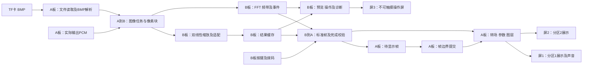

# 选题一：双板协同架构与可行性 V3

> 资源实施约束以[双板资源预算与实施门槛V3.1](双板资源预算与实施门槛-V3.1.md)为准：A首版三帧池，B行缓存缩放，512点单声道非重叠FFT；提前验证存储、算术、链路与双输出骨架。下文的周期数示例不作为已实现性能。

日期：2026-09-19。状态：经本地赛题、硬件资料和基线源码静态分析形成的实施建议，尚未综合、仿真或上板验证。本版响应“突出两块板的共同计算与协同设计”，替代上一版的“A板缩放、B板只做频谱与控制、5MHz SPI为最终链路”的分工。原审查报告中的基线问题、五项扩展、可靠性与固化要求继续适用。

## 1. 从选题一原文推导设计

官方指南PDF物理页14明确：

> 系统需体现FPGA在并行处理、实时控制、低延迟显示、音画同步及多源信息融合等方面的优势。

> 若系统规模较大或功能较为复杂，可使用多块同款FPGA板卡构建主从结构，通过自定义链路将不同功能模块合理部署，实现板间通信。

解析PPT第5～6页要求基础全部实现、扩展至少一项；本项目选择五项扩展全做。基础是TF读取640×480、24位未压缩BMP、SDRAM缓存、HDMI显示、按键切图/轮播、48kHz HDMI测试音、固化启动。扩展是字幕、转场、不同分辨率图片缩放、参数调节和音频波形/频谱。第13页允许音画联动、多屏联动等自主设计。

**据此选择：双板异任务并行，A板守住实时输出，B板执行图像预处理和音频分析。** 一张图片可以在B板处理时，A板仍然读自己的SDRAM连续显示；B板处理的结果必须回到A板的最终画面，形成可展示的协同闭环。

不把LUT占用高当作成绩，不承诺双板一定比单板快两倍。每板各有19600 LUT、29个18×18乘法器、8MiB SDRAM、4个PLL，但两板的存储和时钟相互独立，不能视为透明共享的16MiB内存或58个可随意跨板连线的乘法器。必须计算通信成本和并行收益。

## 2. 推荐的职责边界

| 任务 | A板：实时展示主节点 | B板：计算与交互从节点 |
|---|---|---|
| TF/文件管理 | 单卡读取、有限只读FAT32、BMP头与合法性解析 | 接收已经验证的尺寸与像素流 |
| 图片缩放 | 640×480直通模式，准备输入任务 | 双线性插值、等比例适配、边界填充；提供最近邻对照 |
| 图像缓存 | 当前/下一张/加载帧的所有权与提交 | 源行缓存、处理结果暂存、传输重试保留 |
| 视频实时链路 | 双帧转场、亮度/对比度、字幕/应急图层、两路HDMI | 第三屏的低成本图形与菜单渲染 |
| 音频 | 48kHz PCM生成、HDMI输出、本地波形、样本计数 | 接收实际PCM，窗函数、512点FFT、16频带能量与事件提取 |
| 场景调度 | 最终执行权，决定何时换帧与更新参数 | 提交控制请求与计算结果，不直接改A板有效寄存器 |
| 人机操作 | 本地基础操作与应急降级 | 板载按键/拨码，三屏系统的操作台 |
| 异常恢复 | 继续有效画面和音频，拒绝不完整结果 | 标记任务失败，重连后重新同步任务与状态 |

不让同一个高带宽像素流水线每处理一级就来回跨板。任务按“整次加载/整块PCM”交接，处理完成后才交还结果。

## 3. 完整数据流

A板在显示图n时，读取图n+1并交给B板缩放。B板计算完成的标准图返回A板空闲帧槽；确认完整有效后，A板在帧边界启动转场。加载失败就保留图n，不停止HDMI。

B板的FFT通路与图像通路使用独立输入队列、状态机和存储区域。乘法器优先各分配一部分，使缩放和FFT真实并行；资源不足再做有明确时限的时分复用。不能写成一个阻塞式“大状态机”，导致读图时暂停FFT或菜单。

第三屏建议同时展示当前/下一场景编号、下一帧准备状态、小尺寸预览、频谱和链路状态。预览直接取B板已有处理结果降采样，避免跨板回传整个当前展示画面。第三屏只要求逻辑状态一致，不宣称与两块展示屏光学刷新完全同步。

## 4. 通信选择：DC3上的双向8位源同步链路

### 4.1 为什么调整原SPI建议

仅传单声道PCM与命令时，5MHz SPI够用。现在还需要传图像，必须重新算：RGB888的640×480图为921600字节。5MHz SPI理论仅625000字节/秒；一张图的像素送往B再返回标准图，就至少需要2.95秒，尚未计协议和TF读取。SPI全双工在流式处理时可以有所重叠，但单向载荷上限仍然不足以提供充裕的素材准备时间。

以太网带宽可以满足，但需要PHY/MAC、时钟、帧缓存和协议的额外验证；板上有千兆PHY不代表已有可直接用的千兆通信逻辑。近距离双板没有必要优先承担这部分开发量。

**最终推荐自定义8位并行包链路，两个方向各自独立，初始目标10MHz字节时钟。** 这属于官方允许的自定义链路。SPI可用于学习/早期回环验证，不再作为最终图像协处理的性能基线。

### 4.2 信号与物理层

每个方向：DATA[7:0]、转发时钟CLK、VALID、反向READY，共11根信号；双向共22根GPIO，另加地。已有DC3提供的IO数量在数量上满足，但具体管脚仍需按板版本、时钟可达性、HDMI占用和电气条件核对后选定。

- A→B与B→A的数据线完全分开，无三态总线争用。
- 两个发送端分别转发自己的链路时钟，接收侧再通过异步FIFO进入本地计算域。
- 概念时序为下降沿发数据、上升沿采样，10MHz提供约50ns半周期预算；实际余量需扣除发送、走线、偏斜及建立保持时间。
- READY反向跨域需同步，并为在途数据留FIFO余量，不能把READY当作即时刹车。可按块预留空间/授予额度，允许完成已获准的数据块。
- 由2～5MHz起步验证，再升到10MHz；20MHz仅为布线与时序通过后的备选上限，不作首版承诺。
- 使用短、可靠连接与足够回流地，必要时做无处理器转接小板；不要用松散长杜邦线默认保证10MHz多线同步。
- GPIO为3.3V。两板各自供电，共地；不把整条40芯排线直接一一相连，不连接两板电源输出。

源同步接口的时钟管脚选择、生成时钟、输入/输出延迟与CDC约束是实现前置门槛。这里确定链路形式，不给未经实物核对的可直接照接针脚表。

### 4.3 链路协议与优先级

统一包头：同步字、协议版本、会话号、消息类型、任务/序列号、长度、分块偏移或样本计数、负载、CRC。控制小包可用CRC16；图像块和整帧使用CRC32，参数定义与测试向量统一。

| 消息 | 方向 | 作用 |
|---|---|---|
| IMAGE_BEGIN / IMAGE_DATA / IMAGE_END | A→B | 尺寸、像素格式、缩放目标与图像数据 |
| RESULT_BEGIN / RESULT_DATA / RESULT_END | B→A | 标准化像素及完整性信息 |
| PCM_BLOCK | A→B | 实际音频采样块与样本序号 |
| SPECTRUM / AUDIO_EVENT | B→A | 频带能量、事件与对应采样窗口 |
| COMMAND | B→A | 按键请求，不直接取得显示控制权 |
| ACCEPTED / READY / APPLIED / ERROR | 双向 | 接收、准备、实际生效和错误闭环 |
| CREDIT / HEARTBEAT / STATUS | 双向 | 缓冲额度、在线状态、错误计数 |

建议图像最大负载块512字节。10MHz的裸载荷时间约51.2μs，方便在包间调度控制和PCM。优先级为应急/控制→PCM→频谱→图像；低优先级必须有最低服务份额，避免被控制洪泛饿死。若物理接收长期阻塞，高优先级也无法穿过已阻塞的包，因此必须有块长上限、FIFO余量和超时中止/重同步。

图像块可以有限重传；超限就放弃整次任务，A保留旧图。PCM可不重传，但必须记录缺样并丢弃受影响FFT窗，不能悄悄把断裂样本当连续音频。重连更换会话号，旧结果和旧控制请求一律不能生效。

## 5. 带宽与存储可行性

### 5.1 图像只在切换前传一次

8位×10MHz = 每方向10MB/s理论裸带宽。阶段验收目标设为每方向持续有效载荷≥6MB/s，而非宣称已测得此性能。

| 数据 | 数据量/带宽 | 以6MB/s有效载荷估算 |
|---|---:|---:|
| 640×480 RGB888源图 | 0.9216MB | A→B约0.154s |
| 返回640×480 RGB888标准图 | 0.9216MB | B→A约0.154s |
| 1280×960 RGB888源图 | 3.6864MB | A→B约0.614s |
| 48kHz单声道16位PCM | 0.096MB/s | 约占每方向6MB/s能力的1.6% |
| 16频带、每带16位、每秒60次 | 1920字节/s（不含头） | 可忽略于图像载荷 |

前两项若顺序传输总计约0.307秒，若处理和两方向传输能重叠则更低；这是链路估算，不包含读卡、缩放、重传或调度等待。对于1280×960源图，25MHz SPI读卡仅像素的理论下限约1.18秒，实际读卡很可能是主要瓶颈。

缩放后只返回一张标准图，A板随后在本地以约60Hz持续显示。640×480 RGB888每秒60帧约55.3MB/s，超过10MB/s链路能力，因此**不做每个刷新帧都跨板传输**。同理，不把逐像素转场和实时OSD拆到B板再逐帧送回。

### 5.2 两板存储分别使用

A板保持32位/像素：三帧共3,686,400字节，可逐步扩为五帧6,144,000字节；8MiB内有空间，但仍需验证双帧转场约147.5MB/s的读取和结果回写仲裁。

B板优先用两行缓存进行流式缩放：1280宽RGB888两行7,680字节。结果按32位存入两个标准帧槽共2,457,600字节，便于传输、重试和预览；源行、FFT、字库与链路FIFO按实际RAM块分配。无需为了“充分利用8MiB”而缓存整个源图。

若实现流式缩放过于复杂，可先存一张上限1280×960的32位源图（4,915,200字节）再处理，加两个结果帧共7,372,800字节，剩约0.97MiB；这只是容量上可行的开发备选，访问争用与性能仍需核实，不能再无预算加入额外整帧。

### 5.3 B板计算预算

512点基2FFT每窗2304蝶形，48kHz下非重叠窗口10.667ms；50MHz约533333周期/窗，平均约231周期/蝶形总预算。适合迭代蝶形和复用硬件乘法器，不必做庞大全流水FFT。频率间隔93.75Hz，低频分辨率限制应如实说明。

双线性缩放可以复用乘法器，逐通道处理，工作速度只需跟上图片加载而非两路HDMI刷新。以每个目标像素12个50MHz周期作调度示例，一张标准帧计算约73.7ms；这是待设计的吞吐目标，未包含取数等待，也不是已有测量。

B板29个乘法器可初步分配：缩放4～8个、FFT/窗函数4～8个，其余留余量。实际定点宽度超过18位可能需要拆乘法，必须以综合映射修正预算。FFT和缩放用独立资源时可同时推进；共享SDRAM时用小块仲裁保障PCM采样和第三屏渲染。

## 6. 怎么证明两块板在协同计算

以一次“下一张＋音频可视化”为例：

1. B板按键产生场景请求，A板返回已接收，当前图继续播放。
2. A板解析TF中的下一张BMP，分块发送像素和尺寸；持续并行发送实际播放PCM。
3. B板缩放图像，同时运行FFT；第三屏显示任务号、进度与频谱。
4. B板把缩放结果返回A板；A只写空闲帧槽，块校验/整帧长度/帧CRC全部正确才标记READY。
5. A在帧边界启动转场，并提交字幕、参数；回传APPLIED与frame_id。
6. B根据实际回执更新菜单和场景状态。FFT结果携带样本窗口，A丢弃过期数据后叠加显示。

这形成“请求→分发→并行计算→结果返回→验证→确定时刻执行”的完整闭环。B板有真实的图片处理工作，A板最终画面依赖其结果；两板并非各跑独立演示。

## 7. 三个可成立的创新点及评分对应

| 创新表述 | 技术实质 | 对应要求 | 证据 |
|---|---|---|---|
| 面向双FPGA的异任务音画流水线 | A持续显示，B并行缩放下一图与FFT；图像按次传输 | 并行处理、图片适配、音频可视化、合理主从 | 任务时间线、并行使能、队列水位、实际延迟 |
| 带完整性校验和帧边界提交的场景协同 | 结果不完整不提交；缓冲所有权；图/字幕/参数统一生效 | 稳定、低延迟控制、连续转场 | 错包/延迟/断联故障注入和帧号回执 |
| 分析结果参与多屏音画联动 | 频谱及音频事件改变图层/已准备转场，两展示屏分区提示 | 音画联动、多源融合、实用场景 | 单音/双音/可重复事件驱动的完整演示 |

缩放、FFT、CRC、源同步本身都不是新算法。创新在于针对该平台的分工、调度、结果一致性及可恢复应用，答辩不宣称首创通信或首创FFT。

应急图层留在A板本地，其响应不依赖B板图像任务成功；这也是实时任务与非实时任务分离的价值。B断联后A保留本地BMP直通、基础切图与轮播、音频、波形以及应急功能，明确显示缩放协处理/频谱不可用，不伪造新结果。

## 8. 可行性判断与失败边界

硬件容量和估算带宽支持这条路线，较上一版SPI+频谱架构有更强协同价值，也增加了链路与数据管理难度。现有资料尚不能证明10MHz排线、双输出、完整综合时序或缩放+FFT同时运行已经通过。

| 风险 | 前置验证与处理 |
|---|---|
| 链路多线偏斜/跨时钟错误 | 先选可用时钟管脚；2～5MHz回环；10MHz双向随机载荷与CRC；检查FIFO余量和时序 |
| B板长任务阻塞PCM/控制 | 独立队列与状态机，小包优先调度，帧任务可中止，统计缺样 |
| A板回写影响显示 | 显示读水位保护、突发写限制；在交叉淡化+接收结果时压测 |
| 缩放质量或FFT位宽错误 | 软件黄金模型只用于离线验证，实机计算全部在FPGA；饱和/边界/负数测试 |
| 一板故障影响全系统 | A保留基础独立路径，任务超时与会话重建；B恢复后先同步再接收新任务 |
| 当前基础不足以同时开工 | 单板基线先过，再验证链路，不先铺开所有模块 |

链路在10MHz达不到有效吞吐目标时，优先修连接和时序，再降低支持图像上限或增加预加载等待。不得通过忽略CRC、去掉流控、放宽未依据的时序例外来“通过”。若双板图像路径始终不能可靠工作，退回上一版A缩放+B频谱是明确的工程回退，但不能继续宣传B参与图像协处理。

## 9. 开发与验收顺序

1. 重建并修可靠的单板基线：当前源码、时序、复位、读卡、音频、固化形成对应记录。
2. 两板链路：短包→图案块→双向连续载荷→错误/背压注入。先达到目标吞吐与可靠性再迁移缩放。
3. 图像协处理：A发送小测试图，B先做原样回传，随后最近邻、双线性与等比例适配；A完整校验后显示。
4. 并行音频分析：实际PCM送B，FFT结果回A；在图像传输最大负载时检查缺样和控制延迟。
5. 场景管理：帧池、READY/APPLIED、交叉淡化、多参数一致提交、错误恢复。
6. 三屏集成：先镜像，再分区OSD；B加预览与诊断。用按键/拨码，屏幕不要求触摸。
7. 应急与音频事件联动，最后长稳、冷启动、双板不同上电顺序及无PC演示。

建议新增协同验收：双向有效载荷分别≥6MB/s（目标）；在图像任务运行时48kHz PCM无未解释丢样；坏图/坏CRC结果不得变为ACTIVE；任务准备耗时、命令接收耗时、READY到APPLIED耗时分开统计；故意暂停B板计算时，A画面和音频仍持续。

性能对照使用同一套最终镜像的模式开关：串行调度与并行调度处理同一素材，比较“下一帧准备时间、控制响应、FFT更新、显示欠载”。串行阶段耗时求和与流水稳态受最慢阶段限制只是理论模型；读卡可能限制总吞吐，必须实测后再说是否加速。主要可保证的设计目标是计算并行、实时输出隔离与功能承载能力，而非预设倍数的加速比。

## 10. 推荐名称与答辩主张

最终报名题目统一为“**双FPGA协同音画展示系统**”（13字符）。作品简介与题目已单独整理至[报名用：作品题目与简介](报名用-作品题目与简介.md)，简介正文400字符（含标点及英文字母数字，不含换行），符合500字以内的要求。报名表述按照应用场景、双板协同、主要功能和使用价值展开；应急插播与音频事件联动保留在技术方案中，不作为本版简介的重点承诺。

答辩主张：我们将固定时限的视频输出留在主FPGA，将图片适配和音频分析部署到从FPGA。通过自定义分包链路与帧边界提交，边展示当前内容、边处理下一场景，同时保持音频分析和操作响应；遇到错误时保留有效画面并完成恢复。

必须准备的证据是功能演示、两板模块图、链路时序/带宽、并行任务时间线、最终资源及时序报告、坏包/断联测试，而不是仅展示两块板都亮灯或列出总LUT数量。

来源：[官方解析PPT](D:/fpga/anlu/anlu/anlu/赛题解析一.pptx)；[官方与源码证据索引](../04_审查与历史技术参考/比赛路线审查-证据索引.md)。截止日期、团队投入尚未提供，所以本版只确认建议架构与退出门槛，不承诺具体完成日期。

