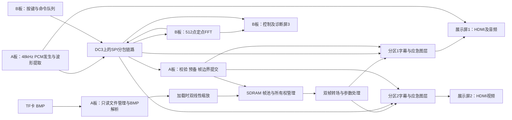

> 交接说明：本文件是历史核查/检查项参考。旧分工、日程、SPI路线、工时与历史进度不作为当前实施依据；以V3架构、V3.1预算和30天单人技术路线为准。外部硬件资料路径请按队友本机位置映射。

# 2026 安路选题一：独立审查与推荐比赛路线

> 双板分工与通信已根据用户最新要求升级，实施以[双板协同架构V3](../01_当前方案/选题一-双板协同架构与可行性-V3.md)为准：A板实时展示，B板图片缩放＋音频分析，图像协处理链路改为DC3双向8位源同步通信。下文的历史核查证据仍有效；A板承担全部缩放、SPI为最终主链路的安排作为早期方案与回退参考保留。

审查日期：2026-09-19。对象：两块 HX4S20C、三块支持 640×480 的 HDMI 屏；当前进度按清单为流水灯已上板。

本次核查了本地官方指南、2026-09-05 解析 PPT、芯片手册、板卡手册、HDMI/GPIO 原理图、lab_ex5 顶层与主要存储/时钟路径、工程清单、附带历史资源及时序报告、现有 V2.1 方案。没有联网、运行综合实现或烧录实物。以下“已核实”指文件证据；资源余量、性能和工期仍须通过当前源码重新构建及上板确认。

配套：[审查证据索引](比赛路线审查-证据索引.md)。原方案保留，本文作为推荐修订稿。

## 1. 决策结论

推荐路线：**双 FPGA 协同音画展控系统——面向展陈与应急插播，五项扩展全部实现，以确定的画面更新、真实音频分析和可恢复运行形成差异化。**

保留两板三屏，但修订原来的分工：展示板承担存储、缩放、合成、两路展示和 HDMI 音频；协处理板承担真实 PCM 频谱计算、按键控制和第三屏诊断。两块展示屏先完成同源镜像，再实现“同背景、不同分区字幕/箭头”的低带宽双输出。主创新不押在屏幕数量、自定义 CRC 或普通 FFT 上，而是它们组成的可测量、可解释的完整应用。

这条路线的技术难度主要在缓存所有权、SDRAM 调度、双线性缩放、FFT 定点实现和跨时钟提交；难度有边界，不需要摄像头、通用处理器、视频编解码或跨板实时传送整帧。目标优先对齐高完成度作品与最佳工程方向。无法根据本地资料保证一等奖，更不能声称这是所有队伍和赛程条件下的绝对最优方案。

**推荐作品名称：声画协同展控系统（8 字）。** 如果“三屏主从多媒体展示系统”已经报名且不便修改，保留名称，用上述定位作副标题。

## 2. 对旧方案的关键纠正

| 原判断/表述 | 核查结果 | 对路线的影响 |
|---|---|---|
| 五项扩展堆满即可冲最高奖 | 官方指南 PDF 物理页 15：综合看数量、难度、质量、稳定和演示，无单项固定分；3 项以上高完成度即可得较高分。较新的解析 PPT 第 6 页明确至少实现一项 | 本项目仍按五项全做，但必须集中做深两三项；五项浅演示不等于强作品 |
| 主从与自定义链路是明确加分项 | 指南允许同款多板合理部署，并未为多板、CRC、三屏规定固定奖励 | 第二块板必须有可解释的计算和交互任务 |
| LUT“紧而够用” | 附带历史布局布线报告：3971/19600 LUT、3790 FF、20/64 个 9Kb RAM、0/16 个 32Kb RAM、0/29 DSP、3/4 PLL | 不能先验认定 LUT 不够；也不能把历史报告当成最终扩展资源保证 |
| 频谱/插值主要消耗 LUT | 芯片手册确认有 29 个 18×18 硬件乘法器 | 应优先利用乘法器及流水线，B 板做迭代 FFT 有合理空间 |
| 双帧缓存约 1.8 MB | RGB888 文件数据如此；当前源码每像素补 8 位后按 32 位写入，实际双帧 2,457,600 字节 | 缓存规划必须按真实存储布局算 |
| 基线已经稳定、POR/超时完整 | lab_ex5 的“代码说明”标题仍是 lab_ex4；顶层复位只纳入外部复位与音频 PLL 锁定，未见另外两个 PLL 锁定参与；BMP 控制路径未见说明所称的完整 1 秒超时恢复 | 必须先建立自己可复现的可靠基线，不能照抄说明作为验收证据 |
| 参考代码已具备 FAT32 文件扫描 | 实际从物理扇区找 BM 头，再连续读取扇区；最多找 4 张，扫描范围 0～131071 | 不跟随 FAT 簇链，可能读到删除残留，不能保证碎片文件。格式化为 FAT32 不等于实现 FAT32 |
| 双缓冲天然无撕裂 | 写完成后在读卡域更新 disp_buf_idx；读取端在每帧请求阶段选址，有帧切换基础，但缺少完整“显示已采用/旧缓冲释放”闭环 | 不能直接判定必然撕裂；必须增加明确所有权和提交确认，防止扩展后过早复用缓冲 |
| 生成 bit 就是时序通过 | 历史 final_timing.rpt（2026-04-24）SWNS=-6.699ns、STNS=-293.216ns，覆盖率95.97% | 存在历史未收敛证据；当前源码是否同样失败必须重建判断 |
| 像素与串行时钟可 exclusive | SDC 将同时运行的 video_clk 与 hdmi_5x_clk 设为 exclusive；串行器存在两域数据传输 | 不能用宽泛时钟例外代替时序/CDC设计。逐路径核对正确关系 |
| 640×480@60 与精确48kHz已证实 | 历史时钟为25MHz像素、800×525总时序，对应约59.524Hz；音频主时钟报告12.295MHz | 标称值和实测值分开。核对PLL、ACR及显示设备容忍度，不能用“可听见”证明精确采样率 |

工程清单的 45 个 File 引用经规范化路径检查均存在。发现路径较长，应在后续开发时复制到简短 work 路径；本次未改原始例程。

## 3. 为什么选这条路线

| 候选 | 优点 | 主要代价 | 决策 |
|---|---|---|---|
| 单板五扩展 | 调试最短、规则贴合 | 两块现有板的协同价值未利用 | 每个阶段的独立可运行基础 |
| 原双板三屏镜像+状态屏 | 复用程度高 | B板任务轻、镜像容易被视为普通分屏器效果 | 作为中途验收，不作为最终创新叙事 |
| 双板协同音画展控+应急插播 | 规则贴合、算法和工程都有深度、可用现有硬件 | 增加PCM传输、FFT与可靠控制 | **推荐目标** |
| 双板视频墙/整帧跨板传输 | 视觉效果直接 | 带宽、同步、独立内容读卡与缓存复杂度显著上升 | 本轮不选 |
| 摄像头+AI、网络视频播放器 | 可能有话题性 | 偏离当前基础，硬件/合规/算法范围大 | 本轮不选 |

按题目明确要求，比赛主线确定为“BMP内容适配＋音画分析与联动＋可靠切换”。非触摸屏采用板载按键/拨码交互；以太网作为后续增强评估；通用视频文件解码不列入本轮交付。

### 用户反馈后的修订：非触摸交互与以太网定位

用户已明确三块屏幕不可触摸。第三屏定位为“按键操作台与状态显示屏”，不需要触摸硬件。触摸交互从备选清单中移除。

交互建议保留独立复位键，其余可用按键按实物资源分配为“上一项/下一项/确认”，拨码选择“播放控制/图像参数/音频分析/诊断”页面。每页底部显示当前按键含义；亮度、对比度等用明确的选中项和步进值调节。正常操作不依赖难以记忆的组合键。应急触发优先使用专用拨码位，其实际映射在复位、普通操作、应急优先级一起确定后落实，不能重复占用同一输入。

以太网的价值按本项目排序如下：

| 用途 | 能展示的价值 | 新增技术工作 | 本次定位 |
|---|---|---|---|
| 更新素材/播放列表 | 展陈内容更新更方便，终端有实际部署意义 | MAC/PHY接口、ARP/IP/UDP、分包重组、校验、重传、存储提交 | 可选后续增强，需先澄清外部主机参与配置/传素材的合规边界 |
| 状态与运行记录导出 | 方便量化欠载、错误、延迟及长稳结果 | 简单状态报文和接收工具 | 可作开发诊断；已有串口也可实现，比赛差异化有限 |
| 两板通信替代SPI | 支持更长连线、后续多节点扩展，均为同款FPGA | 两端MAC、缓冲、包调度、超时；IP/UDP可省略而用自定义二层帧 | 只在明确需要远距离或多节点时采用；现阶段SPI已够用 |
| 实时视频流输入 | 动态内容展示 | 持续吞吐、抖动缓冲、丢包处理；压缩流还需要解码 | 不与第一版基础系统同时承诺 |

因此，第一版保留SPI承担双板通信，以太网不进入五扩展的关键依赖。预留“内容来源接口”和状态计数器，后续可以接以太网模块；不提前开发完整网络栈。若加入网络素材更新，应先接收至临时区，校验完整后提交，接收失败不影响当前播放。写入TF需要新增文件系统写入或明确定义的素材存储区，不能认为已有只读FAT32即可支持；现场PC或其他处理器的角色必须核对比赛规则，不能直接假定允许。

### 按题目原文确定范围

重新核对官方指南PDF物理页14～15及2026-09-05解析PPT第5～6页后，推荐范围如下：基础必须完成640×480、24位未压缩BMP的TF读取、SDRAM缓存、HDMI显示、按键切图/自动轮播、48kHz HDMI测试音与固化启动；五项扩展围绕字幕、转场、不同分辨率图片适配、参数调节和音频频谱/波形。较新的解析PPT明确扩展至少一项，本项目主动选择五项全做。题目没有要求触摸、以太网或MP4/H.264/H.265视频解码。“HDMI视频显示”“叠加于视频画面”描述的是输出画面/信号，并不等于要求解码视频文件。

因此本轮不承担“任意视频格式”目标，也不把“任意图片格式”偷换进E3。E3优先支持不同尺寸的同类未压缩BMP，并以双线性插值和等比例适配提高质量。基础640×480输入模式始终保留。MP4是容器，H.264/H.265等是编码；通用视频播放会引入另一整条解码技术链，不能用模糊名称承诺。

在五项扩展稳定后，增加一个低增量、贴题的自主创新模式：**音频事件驱动的场景联动**。B板从实际PCM的短时能量变化提取事件，使用阈值、迟滞与最小触发间隔抑制误触发；A板仅在下一场景READY时响应，于帧边界启动转场或改变图形效果。准备不足时继续播放当前画面，不等待或卡住视频。它复用已有音频分析和场景提交模块，形成“声音变化→分析事件→画面变化→控制屏回执”的完整链路。先使用可重复的脉冲/音调序列验收，准确称为音频事件触发，不宣传为通用音乐节拍识别。

自主创新的排序为：场景一致更新与应急恢复（必做系统特性）→音频事件联动（五项稳定后的增强）→以太网部署能力（有明确剩余时间和应用需求才做）。每项都必须有现场可观察现象与测试证据。

## 4. 最终系统与创新点

### 创新点A：帧边界统一提交的场景切换

一条场景命令包含图号、亮度/对比度、字幕组、转场方式及声音模式。先验证并准备资源，再在同一输出帧边界提交已准备好的视觉参数，回传实际生效 frame_id。第三屏区分“接收、准备中、已生效、失败”，避免显示“已发送”却不知道屏幕是否执行。

采用 pending/active 两组参数，跨时钟使用握手快照或异步FIFO。多位字段不能逐位打两拍后就视为一致。帧槽状态至少区分 FREE、LOADING、READY、ACTIVE、TRANSITION；仍被显示或转场读取的帧槽不能重写。音频模式在样本边界切换并短时增益渐变，记录与视觉提交的对应关系，不承诺没有设计过的零延迟音画切换。

技术本身有成熟先例，创新表述应是“针对小资源国产FPGA的场景一致性调度与可验证实现”，不宣称首创原子提交。

### 创新点B：真实计算的音画联动与双板合理分工

A板输出的PCM同时送去HDMI、波形提取及B板分析。B板计算512点FFT、汇总16个显示频带并回传；A板把频谱叠加在视频上。演示静音、单音、双音、扫频，频谱位置随输入变化。频谱不能由预存柱高或图号驱动。

B板断联时，A板继续基本播放与本地波形显示，频谱明确显示“数据过期/不可用”；恢复连接后重新同步序号和状态。这里只是运行降级，完整比赛版本仍包含可用频谱功能。

### 创新点C：带实测恢复行为的双分区应急插播

平时两屏显示同背景和各自区域字幕；触发应急后，两屏在共同视频帧边界切到本地常驻警示图层，分别显示不同方向箭头，输出短提示音；解除后返回原播放场景。应急层由字库/图元生成，不等待TF新读图，因此可检验读卡繁忙期间的响应。

这是展陈终端的应急演示模式，不作为经过安全认证的消防系统。双输出共用FPGA时序，显示器自身处理延迟仍可能不同；不能把信号同步写成两块液晶光学显示完全同步。

量化“图号/字幕/亮度一帧生效”“坏图不污染当前画面”“控制板断联后仍能播放”，比单独宣称自定义协议更有说服力。

## 5. 五项扩展的完成深度

| 扩展 | 必交版本 | 重点提高的质量 | 验证方法 |
|---|---|---|---|
| E1 图层字幕 | 背景、半透明字幕条、平滑滚动、应急顶层 | 两路分区字幕不同；字幕不被背景亮度设置影响 | 暗/亮背景、滚动边界、图层优先级 |
| E2 转场 | 帧边界更新的渐黑换图再渐亮；随后完成两图交叉淡化 | 最终主演示为两图交叉淡化，32或64级系数 | 帧编号图/高对比图检查撕裂，监测FIFO欠载 |
| E3 缩放 | 真实读取不同尺寸的24位未压缩BMP，等比例居中加黑边 | 加载时双线性插值，提供最近邻对比开关 | 320×240、640×480、800×600、640×360及非4字节对齐宽度图；目标上限1280×960 |
| E4 参数调节 | 亮度、对比度及参数OSD | 有符号运算、饱和裁剪、帧边界生效 | 灰阶、纯色、极值、连按 |
| E5 音频可视化 | A板真实波形+音量，B板FFT频谱回传并叠加视频 | 16频带、峰值保持、平滑、静音底噪处理 | 单音/双音/扫频及静音，检查频点/幅值变化 |

E3 的1280×960是设计范围目标，不是已经支持。支持范围内应由头部宽高驱动坐标映射；无法支持的格式要明确拒绝。负高度BMP可作为质量增强，若不实现必须报错，不能倒图或继续等待。

原方案只保“音量柱”不足以稳妥覆盖官方所述波形/频谱；应先做真实波形。本项目频谱保留为完整目标。任意大图、实时连续缩放、视频解码、频谱高精度测量、滑动转场均不进入必交范围。

## 6. 实现与资源预算

### 6.1 存储与带宽：容量够，访问方式必须重构

每帧640×480×4 = 1,228,800字节；两帧2,457,600字节；三帧3,686,400字节；五帧6,144,000字节。8MiB SDRAM共8,388,608字节。建议先实现三帧池（显示/待显示/加载），需要预加载时扩至五帧，留下约2.14MiB用于工作区。帧池地址必须统一用“字地址”或“字节地址”，不得混用。

60Hz估算单路读带宽为73.728MB/s；交叉淡化同时读取两帧为147.456MB/s。双展示屏共享已合成像素，分叉只增加不同OSD和输出编码，不需要第二次背景读取。若边加载边缩放，还要计入输出帧写入及刷新、换向、突发间隔的开销。

125MHz×32位=500MB/s只是总线峰值。必须测有效吞吐和最长服务间隔。视频活跃阶段每40ns左右消耗一个32位像素；FIFO深度、双路预取和仲裁最长阻塞时间比平均带宽更关键。带宽验收建议满足最坏业务流量至少1.3倍余量，同时证明连续读显示不欠载。

交叉淡化用两路突发预取FIFO，在像素域按相同坐标混合：C=A+α(B-A)。当前参考读取接口一次选择一帧，不能仅插入乘法器就宣称完成双帧转场。禁止为了后台写图长时间阻断显示读取。

### 6.2 加载时缩放，让难度可控

静态BMP在加载时由FPGA缩放一次，形成640×480标准目标帧，显示期间只顺序读帧。不必让每一刷新帧都重新做源图随机访问，也不必把全部大源图常驻SDRAM。

两行RGB888缓存对1280宽图仅需7,680字节；实际双口组织、预取和边界可能需要更多。以源行推进、目标坐标累加器及行缓存实现双线性插值；读慢时保持旧帧。坐标比值在读取头部后多周期计算，不在像素关键路径放通用除法器。BMP BGR顺序、4字节行对齐、倒序行、尺寸及长度溢出都要处理。

双线性并不等同于高质量任意下采样滤波。用斜线、棋盘格、小字和灰阶对比最近邻，解释缩小时仍可能存在混叠；不要宣称照片级无损缩放。

TF理论25MHz SPI数据上限3.125MB/s，一张640×480 RGB888仅像素就至少约0.295秒，1280×960至少约1.18秒，实际更慢。因此“首次加载”与“预加载后的切换”必须分开计时。应急响应不能依赖读取新图。

### 6.3 文件管理

第一阶段保留原始扇区方式用于复现，并明确其限制。比赛目标实现有限范围的只读FAT32：MBR分区或受控superfloppy布局、BPB解析、根目录、8.3短文件名、FAT簇链、坏链/环路/越界超时；先限制文件数如16张。长文件名可忽略其长名项，使用有效短名；不做写卡、exFAT、复杂目录。

这项不是独立创新宣传重点，但能解决“删了图还出现”“普通复制后碎片文件不能读”的现场风险。若时间不足，只能诚实交付受控连续扇区素材包并核对规则接受度，不能继续称为FAT32文件播放器，也不能运行会清理用户整张卡的工具而未另行授权。

### 6.4 B板频谱与链路

512点、48kHz采样的FFT窗长约10.667ms，频率间隔93.75Hz。每帧2304个基2蝶形；50MHz下每窗口约533333个周期，平均每蝶形约231个周期的总预算，适合复用乘法器的迭代架构。该估算不证明FFT已实现，但说明不必采用庞大全流水结构。

建议PCM缩放至16位有符号，Hann窗，逐级缩放/饱和并记录溢出；能量按频带求和再做对数近似、平滑和峰值保持。内部位宽、乘法器映射和RAM端口以仿真/综合为准。16条柱是频带能量，不能冒称16个高精度音高识别通道。93.75Hz间隔对低频解析能力有限。

板间使用DC3上的3.3V SPI，A为总线主设备，B为协处理从设备；B板按键命令由A定期轮询取走。起步1MHz验证，目标5MHz。PCM采用混合后单声道16位48kHz，裸荷0.768Mbit/s；每1ms一块48样本，加头部后仍远低于5MHz。FFT结果和控制返回流量小。不能误把48kHz立体声24位原始流的带宽当成单声道预算。

帧格式建议：SOF、版本、类型、长度、会话号、序号、样本计数/帧号、负载、CRC16。规定长度上限、超时、丢块标记、重复命令去重及重启后会话更新。CRC16只是检错，不是创新算法。错误PCM块丢弃并标记，FFT重新收窗；控制命令允许有限重试，紧急命令优先，不等待长数据包。

SPI跨时钟通过边沿采样设计或专用接收域+异步FIFO落实，设置外部接口时序约束。两板只连所需信号和地，明确IO电压、方向与上电状态；不要用整条40芯直通排线把两板输出或电源无差别相连。具体针脚在实施时按实物板版本与原理图锁定。

### 6.5 双HDMI、时钟与资源门槛

HDMI_A在手册中确认为可作输入或输出，硬件上双输出有依据。镜像阶段共享编码数据、使用两组PHY；两路不同OSD时需各自编码/发送链，不能仍复用同一组TMDS内容。A板主HDMI保留48kHz音频；第二路优先视频，控制屏也优先视频。若采用DVI兼容的视频编码，应明确其无音频及显示器兼容性边界。

镜像模式不代表两屏共享DDC总线。固定640×480输出可先验证实物三屏，随后补充每口EDID/HPD策略；不能因为同为640×480就认定所有HDMI握手行为一致。

目标以标准640×480约59.94Hz模式为优先，先复现25MHz参考时钟，再决定PLL能否可靠产生25.175MHz及配套5倍时钟；不得只改时序表而不核对ACR。音频12.288MHz目标、实际LRCK与HDMI采样率需测量。共享视频PLL，不为每口额外分配一套PLL。

建议工程预算：A板LUT/寄存器尽量≤70%，ERAM按实际块类型各留≥20%余量，DSP目标≤20/29，PLL计划3/4；B板以≤60%逻辑为目标。它们是设计门槛，不是当前测量值，也不是比赛评分线。超线就看布局布线与实际瓶颈，不能机械删功能。

所有有效时钟路径要求建立/保持检查通过；异步例外须有CDC依据。复位异步拉起、各域同步释放，启动前等待必要PLL锁定及SDRAM初始化。顶层输出AXIS的ready目前未反馈给前级，还需核对加密发送核的吞吐契约；视频源无法停顿时要保证供数或提供合适缓冲。

## 7. 重大风险Top5

| 风险 | 证据/原因 | 处理 |
|---|---|---|
| 基线“能出图”但不可靠 | 历史负裕量、复位/说明不一致、无完整错误闭环 | 独立副本重建；先修时序、复位和超时，记录版本及报告 |
| 五扩展同时启用出现欠载/撕裂 | 双帧读、后台缩放写、跨时钟提交叠加 | 帧所有权、双读FIFO、读优先与水位仲裁、故障计数 |
| TF素材普通复制后失效 | 物理扫描忽略FAT簇链，尺寸硬编码 | 有限只读FAT32与BMP解析；坏输入不提交帧 |
| 双板第二输出挤占核心工期 | 双编码、音频分析和链路都需验证 | 基线后尽早做双口和SPI小验证；镜像→分区、波形→频谱逐步集成 |
| 学习/工期与承诺不匹配 | 当前仅流水灯，截止日期/团队未知 | 里程碑按可验收能力推进，最后20%～25%时间只做验证和演示，不新增功能 |

## 8. 开发顺序与退出门槛

不能照旧顺序把缩放和频谱拖到三屏UI之后。先消除硬件与技术路径的不确定性，再做装饰。

| 阶段 | 工作 | 必须拿到的结果 |
|---|---|---|
| M0 资料冻结与工程复现 | 建短路径副本、固定TD版本、核对清单/IP/约束，补最小FSM/FIFO仿真知识 | 当前源码可重建，报告与源码一一对应；原始资料保留 |
| M1 可靠单板基础 | 图像、轮播、音频、固化；复位/超时/时序/帧提交修正 | 冷启动20次、连续1小时、正常切图100次；有效时序通过 |
| M2 早期技术验证 | 双HDMI彩条/镜像、SPI回环与PCM传输、单独FFT仿真、双源存储读吞吐 | 明确第二输出、链路和双帧带宽可行；不先做精美UI |
| M3 内容管线 | 有限FAT32、BMP错误处理、加载时缩放、帧池 | 正常及碎片文件可读，测试尺寸正确，坏图保持上一帧 |
| M4 五扩展合入 | OSD、亮度/对比度、真实波形、渐变转场；加入双线性、FFT及交叉淡化 | 五项在同一套固化系统中有真实可演示功能，记录质量边界 |
| M5 协同场景 | 控制台、场景统一提交、双分区字幕、应急插播、断联恢复 | 接收/准备/生效闭环；应急响应不受TF读图阻塞 |
| M6 定量优化 | FPGA参考结果比对、边界/拥塞测试、修正瓶颈 | 插值/FFT结果有依据，延迟分项统计，所有计数可解释 |
| M7 封版与演示 | 同套最终镜像、长稳测试、冷启动、资料/视频、无PC彩排 | 8小时、1000次切图、50次冷启动，问题闭环后封版 |

M2的独立测试工程用于开发验证；比赛现场不得靠重新烧录切换基础与扩展。最终交付为两板各自一个固定镜像组成的同一完整系统。

工期暂按一个需要边学边做的团队估算总投入约300～500人时（含调试、文档和余量），并非报价或保证。每周合计40小时约8～13周；多人任务有依赖，不能简单按人数等比例缩短。若剩余不足4周且仍未复现基线，不应承诺完整高质量版本按时完成，应立即压缩美化、分区输出等次要工作，保住五扩展和基本稳定性，再依据剩余时间重新评估目标。

### 功能质量削减顺序

先删滑动转场、额外动画、复杂菜单、任意大图与大字库；再把第二展示口的分区OSD退为镜像、减少字幕模板和支持的最大图片范围；频谱可减刷新率/显示频带但仍做真实频域计算；交叉淡化若实测带宽不够可退为渐黑换图渐亮并准确命名。不能删除五项扩展中的整项，也不能牺牲基础播放、48kHz音频、完整固化和错误恢复来保特效。

## 9. 验收指标与现场演示

以下都是目标，尚无实测完成记录。

| 项目 | 建议验收标准 |
|---|---|
| 基础 | 24位640×480 BMP、手动/自动轮播、HDMI音频及脱离PC冷启动全通过 |
| 画面稳定 | 长稳与1000次切换无未解释的FIFO欠载、错误帧提交；错误输入保持有效旧帧 |
| 画面统一更新 | 已准备场景在指定帧边界一起更新图号/字幕/参数；回执包含实际frame_id |
| 应急延迟 | 从已消抖的有效命令到A板输出应急像素≤2帧；从物理按键起另计消抖和屏幕延迟 |
| 频谱 | 持续48kHz采样流无未解释丢块；显示更新≥30Hz；单音峰值在预期bin附近，双音能分辨足够间隔的两个峰 |
| 波形 | 来自真实输出PCM；静音、削波、频率变化与声音一致 |
| 断联恢复 | 约500ms内标识断联，A继续本地播放；重连后目标2秒内完成状态同步；旧命令不重复执行 |
| 无卡/坏图 | 有界超时与错误码；显示不挂死；重新插卡的自动恢复如实现需单独验收，否则允许按键重扫 |
| 资源及时序 | 当前最终源码的综合/布局布线报告、时钟清单、CDC说明与版本哈希齐全 |
| 可靠性 | 8小时连续运行、50次冷启动；双板上电先后顺序均测；无PC完整彩排至少3次 |

推荐3分钟演示顺序：

1. 0:00～0:25：断电后启动，三屏就绪，出图并出声，说明两板分工。
2. 0:25～0:55：不同尺寸BMP自动适配，切最近邻/双线性对比，同时展示参数OSD。
3. 0:55～1:25：交叉淡化和滚动字幕；第三屏显示准备/已生效帧号。
4. 1:25～1:55：单音→双音→扫频，真实频谱/波形在展示画面联动。
5. 1:55～2:25：读图过程中触发应急，两屏不同方向提示；解除恢复场景。
6. 2:25～3:00：用专用链路断开开关或受控故障注入展示降级与恢复，给出长稳/时序/延迟证据。

若现场仅允许很短演示，先展示“自动适配→声画分析→应急插播”完整故事。不要把宝贵时间用于解释CRC多项式或罗列接口数量。

## 10. 资料主线与暂缓内容

必读次序：

1. 官方指南选题一与2026-09-05解析PPT：核对所有宣称和硬性边界。
2. lab_ex5真正的顶层、工程清单、HDMI音频链：说明文档只作辅助，不可替代源码。
3. bmp_read、sd_card_bmp、frame_fifo_read/write、frame_read_write、sdram：存储访问和提交路径。
4. timing.sdc、PLL配置、lane_lvds_10_1、HDMI发送参考文档：时钟/输出/音频。
5. EG4S20数据手册、DSP/RAM手册与SDRAM参考设计：实现资源依据。
6. 板卡手册与4_GPIO/7_HDMI原理图：只在真正连接和约束时定针脚。
7. 米醋模块二：围绕消抖、时序逻辑、FSM、阻塞/非阻塞学习；随后补FIFO、CDC、流水线和定点算术，边做最小验证边推进。

当前暂缓：摄像头/MIPI、以太网、GPS、RK/其他赛题板卡、全套外设实验、旧单板方案全文重复学习。DSP/PLL/SDRAM手册按遇到的问题读，不要求先读完所有资料再开始。

板卡原理图是此次只读核查资料，不需要启动EDA工具或改硬件。现有资料足以开始；还缺FFT黄金参考与测试向量、受支持BMP测试集、明确比赛日期/队伍能力、显示器型号/音频能力、当前源码重新综合与实物测试结果。

## 11. 建议报名简介（规划语气，交付后再改为成果语气）

本作品拟基于两块安路HX4S20C开发板构建三屏协同音画展控系统。展示节点从TF卡读取不同尺寸BMP图片，通过FPGA完成双线性缩放、帧缓存调度、字幕叠加、转场及亮度对比度调节，输出双路展示画面与48kHz HDMI音频；协处理节点完成PCM频谱分析、交互控制和状态可视化。系统采用帧边界场景提交机制，使图片、字幕和参数一致更新，并支持双分区应急插播、链路异常降级及恢复。作品面向商业展陈和校园信息发布，以可测量的显示连续性、音画联动及故障恢复体现FPGA并行处理与确定时序的优势，最终以同一套固化系统脱离PC运行。

## 12. 下一步具体工作

下一阶段应直接做M0～M1：建立短路径基线副本，重新构建并审查实际时序，梳理复位和帧提交，准备四张规范测试图，上板验证HDMI图像/音频/固化。先取得一份“源码—构建报告—实物现象”对应的基线，再按M2消除双口、带宽和频谱路径风险。

本次交付是路线与静态审查，未对当前工程代码作功能修改，未实际验证任何新的扩展。当前仍待用户补充：截止时间、团队人数与能力、每周投入、三块显示器具体型号和哪一路能出声、是否有逻辑分析仪。上述信息影响工期和实现深度，不改变先修可靠基线的优先级。

